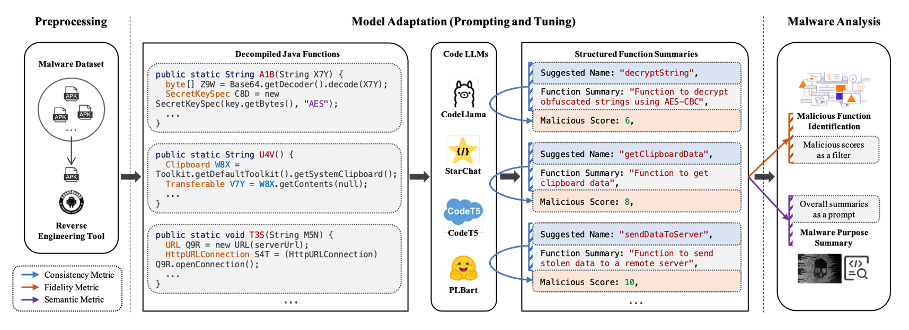
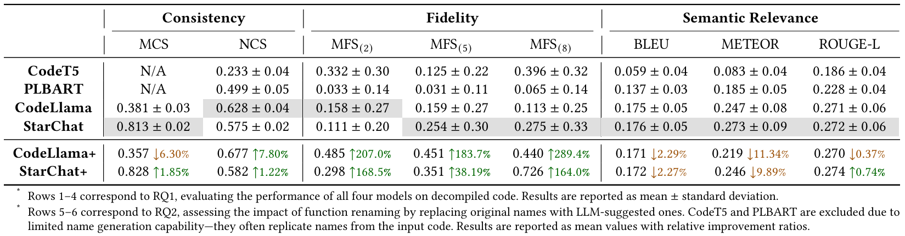

# CAMA Benchmark Framework

## On Benchmarking Code LLMs for Android Malware Analysis

This paper has been accepted to the 34th ACM SIGSOFT ISSTA Companion (LLMSC Workshop 2025).

Paper: https://dl.acm.org/doi/10.1145/3713081.3731745

Dataset: https://zenodo.org/records/15155917

## Overview
Large Language Models (LLMs) have demonstrated strong capabilities in various code intelligence tasks. However, their effectiveness for Android malware analysis remains underexplored. Decompiled Android malware code presents unique challenges for analysis, due to the malicious logic being buried within a large number of functions and the frequent lack of meaningful function names. 

This paper presents CAMA, a benchmarking framework designed to systematically evaluate the effectiveness of **C**ode LLMs in **A**ndroid **M**alware **A**nalysis. CAMA specifies structured model outputs to support key malware analysis tasks, including malicious function identification and malware purpose summarization. Built on these, it integrates three domain-specific evaluation metrics (consistency, fidelity, and semantic relevance), enabling rigorous stability and effectiveness assessment and cross-model comparison. 

We construct a benchmark dataset of 118 Android malware samples from 13 families collected in recent years, encompassing over 7.5 million distinct functions, and use CAMA to evaluate four popular open-source Code LLMs. Our experiments provide insights into how Code LLMs interpret decompiled code and quantify the sensitivity to function renaming, highlighting both their potential and current limitations in malware analysis.

### Pipeline




### Result



## License

This project is licensed under the Apache 2.0 License - see the [LICENSE](LICENSE) file for details.

## Citation

If you find this research helpful for your publications, please kindly cite: 
```
@inproceedings{he2025benchmarking,
  title={On benchmarking code llms for android malware analysis},
  author={He, Yiling and She, Hongyu and Qian, Xingzhi and Zheng, Xinran and Chen, Zhuo and Qin, Zhan and Cavallaro, Lorenzo},
  booktitle={Proceedings of the 34th ACM SIGSOFT International Symposium on Software Testing and Analysis},
  pages={153--160},
  year={2025}
}
```
